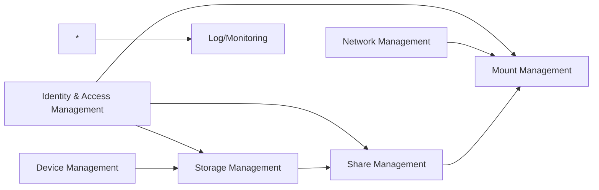
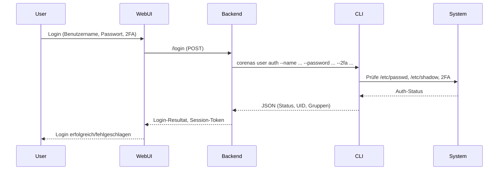
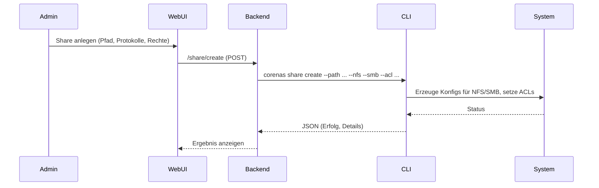
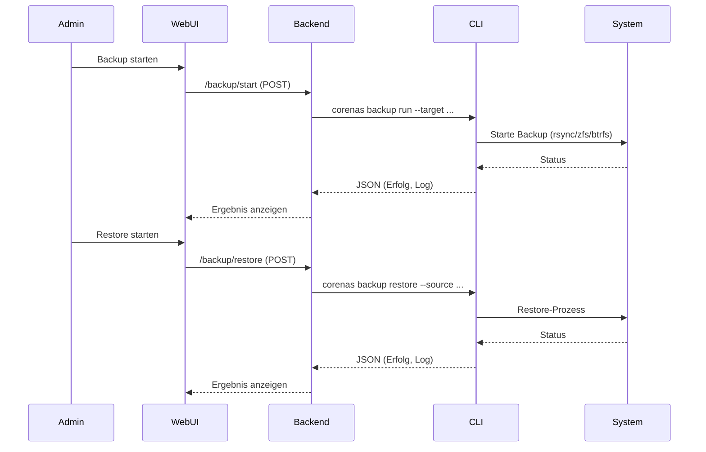

# Hinweis zur Dokumentationsstruktur

Die CoreNAS-Dokumentation ist nach Best Practice in mehrere thematische Dateien aufgeteilt:
- PROJEKT_DOKU.md (Architektur, Konzepte, Module, technische Details)
- ENTWICKLUNGSPLAN_CHECKLISTE.md (Schritt-für-Schritt-Entwicklungsplan)
- ENTWICKLUNGSPLAN_EINZELENTWICKLER.md (Phasenplan, MVP, Iterationen)
- USER_GUIDE.md (Anwenderhandbuch)
- CONTRIBUTING.md (Contribution Guide für Entwickler)
- RELEASE_NOTES.md (Release Notes & Changelog)

Weitere Dokumente (z. B. API-Referenz, Hardware-Kompatibilität) können im docs/-Verzeichnis ergänzt werden.

---

## 28. Entwicklungsplan für Einzelentwickler (mit KI-Unterstützung)

**Ziel:** Schrittweise, realistische Umsetzung von CoreNAS als Einzelentwickler mit KI-Tools (Copilot, ChatGPT, automatisierte Tests, Doku-Generatoren).

### 1. Initiale Vorbereitung (2–3 Wochen)
- Projekt-Repo anlegen, Doku übernehmen, Toolchain (Python, Node, Docker, VS Code, Git, CI/CD) einrichten
- Basis-Tests, Linter, Black, Flake8, mypy, pytest, Coverage, Pre-Commit-Hooks
- Beispielmodule (Hello World CLI, Backend, Frontend) lauffähig machen

### 2. Architektur & Modularisierung (2–3 Wochen)
- Verzeichnisstruktur nach Doku anlegen (CLI/Backend/Frontend)
- Modul-Skelette für alle Kernmodule (IAM, Network, Device, Storage, Share, Mount, Log)
- Schnittstellen, Datenflüsse, JSON-Schemas, Fehlerbehandlung definieren

### 3. Implementierung der Kernmodule (12–16 Wochen)
- IAM (User, Group, ACL, 2FA, Audit)
- Network (systemd-networkd, Profile, VLAN, Bonding)
- Device (Scan, Info, Wipe, SMART)
- Storage (ZFS, btrfs, LVM, mdadm, single_disk, Assistent)
- Share (SMB, NFS, Multiprotokoll, ACL)
- Mount (systemd units, Templates, Automount)
- Log/Monitoring (Audit, Export, Alerting)
- Für jedes Modul: erst CLI, dann Backend-Anbindung, dann Frontend-Komponente

### 4. Web-UI & Integration (6–8 Wochen)
- Vue.js-Frontend aufsetzen, Auth, State-Management, i18n
- Module als Komponenten abbilden, CLI-Proxy im Backend anbinden
- Usability, Fehlerhandling, Security (2FA, Rechteprüfung)

### 5. Security, Compliance, Backup (3–4 Wochen)
- Security-Features (2FA, Passwort-Policy, Brute-Force-Schutz, Audit-Log)
- Backup/Restore-CLI, Disaster Recovery, Compliance-Checks

### 6. Testabdeckung, CI/CD, Doku (4–6 Wochen)
- Unit-/Integrationstests für alle Module, Coverage >90%
- End-to-End-Tests (Cypress/Playwright)
- Automatisierte Builds, Linting, Security-Checks (Bandit, Lynis)
- Entwickler- und User-Doku, Release-Notes, Changelog

### 7. Stabilisierung & Release (2–4 Wochen)
- Bugfixing, Refactoring, Performance-Optimierung
- Test-Deployments, Hardware-Tests, Community-Feedback
- Erstes Release, Support-Kanäle, Issue-Templates

**Tipps:**
- Immer iterativ und testgetrieben arbeiten (TDD/CI/CD)
- KI für Code-Generierung, Tests, Doku, Refactoring und Recherche nutzen
- Regelmäßig Backups und Branches anlegen
- Fokus auf MVP und Erweiterbarkeit, nicht Perfektion
- Zeit für Hardware- und Integrationstests einplanen

**Empfohlene Reihenfolge:**
1. CLI-Module → 2. Backend-Proxy → 3. Frontend → 4. Security/Backup → 5. Tests/Doku → 6. Release

**Zeitbedarf gesamt:**
8–12 Monate (realistisch, inkl. Pausen, Bugfixes, Einarbeitung)
---

## 18. Beitrag & Community

- Pull Requests willkommen! Siehe CONTRIBUTING.md im Repo.
- Issue-Templates und Code of Conduct vorhanden.
- Support/Fragen: GitHub Issues, Matrix/Discord-Channel (siehe README).
- Feature-Wünsche und Bug-Reports bitte mit klarer Beschreibung und Log-Auszug.

## 19. Release- und Update-Strategie

- Versionierung nach SemVer (Major.Minor.Patch).
- Jeder Release erhält Changelog und Release-Notes.
- Upgrade-Anleitungen im Wiki/Handbuch.
- Automatisierte Tests und CI vor jedem Release.

## 20. Datenschutz & Compliance

- DSGVO-Konformität: Privacy by Design, Datenexport/-löschung auf Anfrage.
- Keine Telemetrie, keine Cloud-Zwangsdienste.
- Audit-Logs und Userdaten können exportiert/gelöscht werden.

## 21. Disaster Recovery & Notfallbetrieb

- Notfallplan im Wiki: Schritt-für-Schritt-Anleitung bei Totalverlust.
- Recovery-Checkliste (Backup, Restore, Hardwaretausch, Support-Kontakt).
- Regelmäßige Tests der Restore-Prozesse empfohlen.

## 22. Monitoring- & Alerting-Integrationen

- Unterstützung für Prometheus, Grafana, E-Mail, Webhooks, SIEM.
- Beispiel-Exporter und Webhook-Templates im Repo.
- Anbindung an externe Monitoring-Systeme über CLI/Backend möglich.

## 23. CLI-Kommandos: Übersicht (Auszug)

| Modul    | Subkommando         | Parameter/Optionen                | Beispiel                                  |
|----------|---------------------|-----------------------------------|-------------------------------------------|
| user     | add                 | --name, --password, --shell, ...  | corenas user add --name max ...           |
| user     | del                 | --name                            | corenas user del --name max               |
| group    | add                 | --name                            | corenas group add --name nasadmins        |
| storage  | create              | --type, --devices, ...            | corenas storage create --type zfs ...      |
| share    | create              | --path, --nfs, --smb, --acl ...   | corenas share create --path ... --nfs ...  |
| mount    | add                 | --source, --target, --type ...    | corenas mount add --source ... --type nfs  |
| log      | view                | --filter, --since, --level ...    | corenas log view --filter error           |

Weitere Details und alle Optionen siehe CLI-Hilfetexte (`corenas <modul> --help`).

## 24. Security-FAQ

**Wie werden Passwörter gespeichert?**
- Nur gehasht (bcrypt, crypt, PAM), nie im Klartext.

**Wie funktioniert 2FA?**
- TOTP (z. B. Google Authenticator) und WebAuthn werden unterstützt.

**Wie werden Updates gehandhabt?**
- Über Paketmanager (apt/pip/npm) oder Git-Pull, siehe Release-Notes.

**Wie kann ich ein kompromittiertes System erkennen?**
- Über Audit-Logs, Monitoring, Security-Alerts.

**Wie kann ich Daten sicher löschen?**
- Über CLI (`corenas device wipe --method secure`), siehe Doku.

**Wie kann ich einen User komplett entfernen?**
- Über CLI (`corenas user del --name ...`), inkl. Home und ACLs.

**Wie kann ich die Audit-Logs exportieren?**
- Über CLI (`corenas log export --format json`), siehe Doku.

## 25. Migration & Upgrade-Workflows

- Beispiel: Migration von Altsystemen (z. B. rsync, Datenimport, Usermigration).
- Major-Upgrades: Vorher vollständiges Backup, Changelog beachten, Restore testen.
- Schritt-für-Schritt-Anleitungen im Wiki.

## 26. Mehrsprachigkeit der Dokumentation

- Die Doku ist modular aufgebaut und kann mit Sphinx/mkdocs in mehrere Sprachen übersetzt werden.
- Community-Übersetzungen willkommen (siehe CONTRIBUTING.md).

## 27. Hardware-Kompatibilitätsliste (Beispiel)

| Komponente         | Getestet/Empfohlen           | Hinweise                  |
|--------------------|------------------------------|---------------------------|
| HDD/SSD            | WD Red, Seagate IronWolf     | 24/7 geeignet, SMART      |
| NVMe               | Samsung 970 Evo, Kingston    | Für Cache/Performance     |
| NIC                | Intel I210, Realtek RTL8125  | VLAN/Bonding getestet     |
| RAID-Controller    | LSI 9300-8i, Adaptec 6405    | IT-Mode empfohlen         |
| Mainboard/SoC      | Supermicro, ASRock Rack      | ECC-RAM empfohlen         |

Weitere getestete Hardware und Erfahrungsberichte siehe Wiki/Community.
# CoreNAS Projektdokumentation

## 1. Einleitung & Zielsetzung

CoreNAS ist eine modulare NAS-Software für Debian 12, die konsequent auf eine CLI-basierte Architektur setzt. Ziel ist es, eine sichere, wartbare und erweiterbare Lösung für den professionellen Einsatz zu schaffen, die ohne klassische API auskommt und deren Web-Oberfläche ausschließlich über die CLI kommuniziert.

## 2. Systemübersicht & Architektur

### 2.1 Gesamtarchitektur

- **CLI-zentriert:** Alle Kernfunktionen werden als eigenständige CLI-Kommandos implementiert. Die CLI gibt strukturierte JSON-Ausgaben zurück.
- **Web-UI:** Das Frontend (Vue.js) kommuniziert ausschließlich über das Backend (Flask), das als Proxy für die CLI dient. Es werden keine APIs im klassischen Sinne bereitgestellt.
- **Backend:** Python (Flask) dient als Webserver und Session-Manager, SQLite als Konfigurations- und Sessiondatenbank.
- **Modularität:** Jedes Modul (z. B. Storage, Shares, Netzwerk) ist als eigenständige CLI-Komponente realisiert.

### 2.2 Architekturdiagramm

```
[Web-Browser]
    |
[Vue.js Frontend]
    |
[Flask Backend (CLI-Proxy)]
    |
[CoreNAS CLI]
    |
[Systemdienste & Dateisystem]
```

### 2.3 Empfohlene Verzeichnisstruktur

#### 2.3.1 Systemstruktur (Laufzeit, Daten, Konfiguration)

```text
/etc/corenas/           # Zentrale Konfigurationen
├── corenas.conf        # Hauptkonfiguration
├── users.d/            # User-/Gruppen-Metadaten
├── share.d/            # Share-Konfigurationen
├── export.d/           # Export-/Protokoll-Configs
/mnt/corenas/           # Storage-Pools, Volumes, Devices
/storage/               # Netzwerkfreigaben (Shares)
/var/log/corenas/       # Logs, Audit-Trail
/var/lib/corenas/       # Datenbank, Sessions, interne States
/var/backups/corenas/   # Backups (Konfig, Meta, Daten)
/usr/local/bin/         # CLI-Kommandos (corenas-*)
```

| Verzeichnis              | Zweck/Beschreibung                       |
|--------------------------|------------------------------------------|
| /etc/corenas/            | Zentrale und modulare Konfiguration      |
| /mnt/corenas/            | Storage-Pools, Volumes, Devices          |
| /storage/                | Netzwerkfreigaben (Shares)               |
| /var/log/corenas/        | Logs, Audit-Trail                        |
| /var/lib/corenas/        | Datenbank, Sessions, interne States      |
| /var/backups/corenas/    | Backups (Konfig, Meta, Daten)            |
| /usr/local/bin/          | CLI-Kommandos (corenas-*)                |

#### 2.3.2 Software-Repository (Beispielstruktur)

```text
corenas/                  # Hauptprojektverzeichnis (Repo-Root)
├── cli/                  # Python-CLI-Komponenten (Module)
│   ├── user.py           # IAM-CLI
│   ├── network.py        # Network-CLI
│   └── ...
├── backend/              # Flask-Backend (Proxy, Session, Auth)
│   ├── app.py
│   └── ...
├── frontend/             # Vue.js-Frontend (Web-UI)
│   ├── src/
│   └── ...
├── tests/                # Unit-/Integrationstests
├── docs/                 # Projektdokumentation
├── scripts/              # Setup, Build, Tools
├── Makefile              # Build-/Test-Tasks
├── requirements.txt      # Python-Abhängigkeiten
├── package.json          # npm-Abhängigkeiten (Frontend)
└── README.md             # Projektübersicht
```

**Hinweis:**
Für eine bessere Wartbarkeit und Übersichtlichkeit wird empfohlen, alle größeren Module (z. B. Storage, Network, IAM) intern weiter zu unterteilen – z. B. pro Backend, Protokoll oder Teilfunktion. Beispiel Storage:


```text
cli/
├── storage/
│   ├── zfs/
│   │   ├── __init__.py
│   │   └── ...
│   ├── btrfs/
│   │   ├── __init__.py
│   │   └── ...
│   ├── lvm/
│   │   └── ...
│   ├── mdadm/
│   │   └── ...
│   └── single_disk/
│       └── ...
```

Analog wird dies für alle Hauptmodule (z. B. network, share, mount, IAM, log/monitoring) empfohlen – sowohl im CLI als auch im Backend. Jedes Modul erhält eigene Unterordner pro Backend, Protokoll oder Teilfunktion, um Logik, Workflows und Tests sauber zu trennen und die Erweiterbarkeit zu maximieren. Auch Single-Disk-Backends (klassische Einzellaufwerke ohne RAID/LVM/btrfs/zfs) werden als eigenes Untermodul geführt, um die Verwaltung, Erweiterung und Testbarkeit zu vereinheitlichen und zu erleichtern.


**Verbindliche Struktur für CoreNAS (maximale Modularisierung, CLI und Backend):**

Die folgende Ordnerstruktur ist für alle CoreNAS-Module (CLI und Backend) verbindlich umzusetzen. Jedes Hauptmodul erhält eigene Unterordner pro Backend, Protokoll oder Teilfunktion. Einzeldateien pro Backend/Protokoll sind nicht zulässig. Diese Struktur ist Grundlage für Wartbarkeit, Erweiterbarkeit und Testbarkeit des gesamten Projekts.

```text
cli/
├── storage/
│   ├── zfs/
│   ├── btrfs/
│   ├── lvm/
│   ├── mdadm/
│   └── single_disk/
├── network/
│   ├── ethernet/
│   ├── vlan/
│   ├── bonding/
│   └── wifi/
├── share/
│   ├── smb/
│   ├── nfs/
│   ├── ftp/
│   └── sftp/
├── mount/
│   ├── local/
│   ├── remote/
│   └── cloud/
├── iam/
│   ├── local/
│   ├── ldap/
│   └── saml/
├── log/
│   ├── audit/
│   ├── monitoring/
│   └── alerting/

backend/
├── storage/
│   ├── zfs/
│   ├── btrfs/
│   ├── lvm/
│   ├── mdadm/
│   └── single_disk/
├── network/
│   ├── ethernet/
│   ├── vlan/
│   ├── bonding/
│   └── wifi/
├── share/
│   ├── smb/
│   ├── nfs/
│   ├── ftp/
│   └── sftp/
├── mount/
│   ├── local/
│   ├── remote/
│   └── cloud/
├── iam/
│   ├── local/
│   ├── ldap/
│   └── saml/
├── log/
│   ├── audit/
│   ├── monitoring/
│   └── alerting/
```

**Alternativ (vereinfachte Variante, weniger modular, für kleine Projekte):**
```text
backend/
├── storage/
│   ├── zfs.py
│   ├── btrfs.py
│   ├── lvm.py
│   ├── mdadm.py
│   └── single_disk.py
├── network/
│   ├── ethernet.py
│   ├── vlan.py
│   ├── bonding.py
│   └── wifi.py
├── share/
│   ├── smb.py
│   ├── nfs.py
│   ├── ftp.py
│   └── sftp.py
├── mount/
│   ├── local.py
│   ├── remote.py
│   └── cloud.py
├── iam/
│   ├── local.py
│   ├── ldap.py
│   └── saml.py
├── log/
│   ├── audit.py
│   ├── monitoring.py
│   └── alerting.py
```
*Hinweis: Die Variante mit Unterordnern ist für größere, wachsende Projekte empfohlen, da sie die Erweiterbarkeit, Testbarkeit und Wartbarkeit deutlich verbessert.*
Diese Struktur sorgt für maximale Übersichtlichkeit, klare Verantwortlichkeiten und einfache Erweiterbarkeit – sowohl im CLI als auch im Backend. Neue Backends, Protokolle oder Teilfunktionen können so jederzeit modular ergänzt werden.

| Verzeichnis/Datei      | Zweck/Beschreibung                        |
|------------------------|-------------------------------------------|
| cli/                   | Python-CLI-Kommandos (Module)             |
| backend/               | Flask-Backend (Proxy, Session, Auth)      |
| frontend/              | Vue.js-Frontend (Web-UI)                  |
| tests/                 | Unit-/Integrationstests                   |
| docs/                  | Projektdokumentation                      |
| scripts/               | Setup-/Build-/Hilfsskripte                |
| Makefile               | Build-/Test-Tasks                         |
| requirements.txt       | Python-Abhängigkeiten                     |
| package.json           | npm-Abhängigkeiten (Frontend)              |
| README.md              | Projektübersicht, Einstieg                |


## 3. Modulbeschreibungen

**Hinweis zur Modularisierung:**
Jedes größere Modul (z. B. Storage, Network, IAM) sollte im Quellcode und in der Konfiguration in Unterordner/Teilmodule pro Backend, Protokoll oder Funktion gegliedert werden. Beispiel: Storage-Backends (zfs, btrfs, lvm, mdadm) als eigene Unterordner und Python-Module. Das erleichtert Wartung, Erweiterung und Testbarkeit und verhindert zu große, unübersichtliche Dateien. Analog empfiehlt sich dies für Netzwerkprotokolle, Share-Backends, Mount-Typen usw.

### 3.1 Identity and Access Management
#### Technischer Deep-Dive: IAM

**Architektur & Komponenten:**
- Das IAM-Modul besteht aus einer eigenständigen Python-CLI-Komponente, die direkt mit den Systemdateien (/etc/passwd, /etc/group, /etc/shadow) und optionalen Zusatzdaten arbeitet.
- Die CLI ist strikt in Subkommandos (user, group, acl, password) gegliedert und gibt alle Ausgaben als strukturiertes JSON zurück.
- Alle sicherheitsrelevanten Operationen (z. B. Rechteänderungen, Passwortänderungen) werden im Audit-Log protokolliert.

**CLI-Design:**
- Input-Validierung erfolgt zentral (z. B. keine Sonderzeichen, UID/GID-Bereich, Passwort-Policy).
- Fehlerausgaben sind maschinenlesbar (JSON mit Fehlercode, Message, ggf. Stacktrace im Debug-Modus).
- Alle Kommandos unterstützen --json und --dry-run.
- Automatische Generierung von Hilfetexten und Beispielen (z. B. corenas user add --help).

**Security-Implementierung:**
- Passwort-Handling ausschließlich über PAM/crypt, keine Klartext-Speicherung.
- 2FA-Mechanismus für alle Admin-Operationen (TOTP, WebAuthn, optional Hardware-Token).
- Explizite Trennung von System- und NAS-Benutzern (Whitelist/Blacklist, UID/GID-Range).
- Schutz vor Brute-Force durch Lockout und Audit-Log.
- Alle Änderungen werden mit User, Zeitstempel, Aktion und Ergebnis geloggt (Audit-Trail, manipulationssicher).

**Fehlerbehandlung:**
- Alle Fehlerfälle (z. B. ungültige Eingaben, Systemfehler, Rechteverletzungen) werden mit klaren Fehlercodes und -nachrichten zurückgegeben.
- Fehler werden im Audit-Log dokumentiert.
- Bei kritischen Fehlern (z. B. Manipulationsversuch, Policy-Verstoß) erfolgt eine Benachrichtigung an den Admin.

**Erweiterbarkeit:**
- Neue Authentifizierungsmechanismen (z. B. LDAP, SAML, OpenID) können als optionale Backends integriert werden.
- Self-Service- und Delegationsfunktionen (z. B. temporäre Accounts, Einladungslinks) sind modular erweiterbar.
- Die CLI ist so gestaltet, dass neue Subkommandos und Attribute einfach ergänzt werden können.

**Best Practices:**
- Regelmäßige Überprüfung und Bereinigung inaktiver Accounts.
- Durchsetzung starker Passwort-Policies und 2FA für alle Admins.
- Nutzung von Audit-Log-Analyse für Compliance und Security-Monitoring.
- Automatisierte Tests für alle IAM-Kommandos (Unit- und Integrationstests).

#### Zielsetzung
Das Modul Identity and Access Management (IAM) stellt die Verwaltung von Benutzern, Gruppen und Zugriffsrechten auf Basis von UID/GID und ACLs sicher. Ziel ist eine sichere, nachvollziehbare und systemkonforme Benutzerverwaltung, die Konflikte mit Systemkonten vermeidet und granulare Rechtevergabe ermöglicht.

#### Anforderungen

#### Interaktive Assistenten für Storage-Systeme
Für jedes unterstützte Storage-System (ZFS, btrfs, LVM, mdadm) steht ein interaktiver Assistent zur Verfügung, der den Anwender Schritt für Schritt durch die Einrichtung führt. Ziel ist es, auch komplexe Konfigurationen sicher, nachvollziehbar und fehlerfrei zu ermöglichen.

**Funktionen des Assistenten:**
- Automatische Erkennung der verfügbaren Devices und Anzeige kompatibler Optionen
- Abfrage aller relevanten Parameter (z. B. RAID-Level, Verschlüsselung, Caching, Kompression, spezielle Features)
- Validierung der Eingaben und Warnung bei potenziellen Problemen (z. B. inkompatible Devices, zu kleine Kapazität, fehlende Redundanz)
- Vorschläge für empfohlene Einstellungen je nach Einsatzzweck (z. B. Backup, Performance, Redundanz)
- Übersichtliche Zusammenfassung der gewählten Konfiguration vor Ausführung
- Möglichkeit, die Konfiguration als Vorlage/Profil zu speichern
- Integration in die CLI (z. B. `corenas storage wizard --type zfs`)


**Vorteile:**
- Reduziert Fehlerquellen und vereinfacht die Einrichtung auch für weniger erfahrene Anwender
- Sorgt für konsistente, dokumentierte und nachvollziehbare Storage-Konfigurationen
- Unterstützt Best Practices und gibt Hinweise zu Vor- und Nachteilen der gewählten Optionen

**Erweiterungsvorschläge für die Assistenten:**
- Kontextabhängige Hilfetexte und Tooltips zu allen Optionen (inkl. Vor- und Nachteilen, Best Practices, Warnungen)
- Live-Vorschau der resultierenden Konfiguration (z. B. generierte CLI-Befehle, geplante Partitionierung, erwartete Redundanz/Performance)
- Automatische Prüfung auf Kompatibilität mit bestehenden Pools/Volumes und Warnung bei Überschneidungen
- Option, die Konfiguration als YAML/JSON-Template zu exportieren/importieren (für Wiederverwendung oder Automatisierung)
- Integration eines „Dry-Run“-Modus: Simulation der geplanten Änderungen ohne Ausführung
- Schrittweises Rollback: Nach jedem Schritt kann der User abbrechen und zum letzten sicheren Zustand zurückkehren
- Automatische Erkennung und Anzeige von Hardware-Features (z. B. SSD/HDD, Sektorgröße, SMART-Status, TRIM-Unterstützung)
- Empfehlungen für Redundanz, Performance und Kapazität je nach Einsatzzweck (z. B. Backup, VM-Storage, Media, Datenbank)
- Optionale Integration mit externen Wissensdatenbanken (z. B. ZFS/Btrfs/LVM-Wikis) für weiterführende Infos direkt im Assistenten

**Beispiel:**
```bash
# Interaktiver Assistent für ZFS-Pool
corenas storage wizard --type zfs
# Interaktiver Assistent für btrfs
corenas storage wizard --type btrfs
# Interaktiver Assistent für LVM
corenas storage wizard --type lvm
# Interaktiver Assistent für mdadm
corenas storage wizard --type mdadm
```
- Verwaltung von Benutzern und Gruppen ausschließlich ab UID/GID 10000
- Unterstützung für POSIX-ACLs auf Shares und Dateisystemen
- Integration in die Systemdateien /etc/passwd, /etc/group, /etc/shadow
- Trennung von System- und NAS-Benutzern
- CLI-Kommandos für alle Operationen (add, delete, modify, list)
- Automatische UID/GID-Vergabe im erlaubten Bereich
- Unterstützung für Benutzerattribute (Name, Passwort, Shell, Home-Verzeichnis, etc.)

**Erweiterte Anforderungen:**
- UID/GID-Bereiche:
    - Admins und Admin-Gruppen: 10000–20000
    - User und User-Gruppen: 50000–100000
- Verwaltung und Änderung von SMB-Passwörtern pro Benutzer (smbpasswd)
- Nur Admins (UID/GID 10000–20000) können sich am Web-UI anmelden; User/User-Gruppen dienen ausschließlich dem Zugriff auf Shares
- 2FA-Unterstützung für CLI und Web-UI (z. B. TOTP, WebAuthn)
- Sichere Passwortvorgaben und Passwort-Generator (z. B. mindestens 12 Zeichen, Groß-/Kleinbuchstaben, Zahlen, Sonderzeichen)

#### Technische Umsetzung
- Alle Operationen erfolgen über die CLI (z. B. `corenas user add ...`)
- Die CLI interagiert direkt mit den Systemdateien (/etc/passwd, /etc/group, /etc/shadow) und prüft, dass keine Systemkonten verändert werden
- UID/GID werden automatisch aus dem Bereich >=10000 vergeben
- UID/GID werden automatisch aus dem passenden Bereich vergeben (Admins: 10000–20000, User: 50000–100000)
- ACLs werden mit setfacl/getfacl verwaltet
- SMB-Passwörter werden pro Benutzer über smbpasswd gesetzt und geändert (CLI: `corenas user set-smb-password`)
- Änderungen werden geloggt (Audit-Trail)
- 2FA-Mechanismus für CLI und Web-UI (z. B. TOTP via Google Authenticator, WebAuthn)
- Passwort-Generator und Passwort-Policy in CLI und Web-UI integriert
- Web-UI prüft Admin-Berechtigung (UID/GID im Admin-Bereich) bei Login
- User/User-Gruppen können sich nicht am Web-UI anmelden, sondern werden nur für Share-Zugriffe verwendet

#### CLI-Befehle (Beispiele)
```bash
# Benutzer anlegen
corenas user add --name max --password geheim --shell /bin/bash --home /srv/nashome/max

# Benutzer löschen
corenas user del --name max

# Benutzer auflisten
corenas user list --json

# Gruppe anlegen
corenas group add --name nasadmins

# Gruppe zuweisen
corenas user mod --name max --add-group nasadmins

# ACL setzen
corenas acl set --path /srv/share1 --user max --perm rwx

# ACL anzeigen
corenas acl get --path /srv/share1

# SMB-Passwort setzen/ändern
corenas user set-smb-password --name max --password geheim
```

#### Datenquellen
- /etc/passwd, /etc/group, /etc/shadow (Systembenutzer)
- /etc/corenas/users.d/ (optionale Zusatzinfos, z. B. UI-Präferenzen)
- setfacl/getfacl für ACLs

#### Sicherheitsaspekte
- UID/GID-Vergabe ausschließlich ab 10000
- UID/GID-Bereiche werden strikt eingehalten (Admins: 10000–20000, User: 50000–100000)
- Keine Veränderung von Systemkonten (root, daemon, etc.)
- Passwort-Handling über PAM/crypt
- Audit-Log für alle Änderungen
- Validierung aller Eingaben (z. B. keine Sonderzeichen in Namen)
- 2FA-Pflicht für Admin-Logins (CLI & Web-UI)
- Durchsetzung sicherer Passwörter (Policy, Generator, Prüfung auf Komplexität)

#### Beispiele & Workflows
**Neuen Benutzer anlegen:**
1. CLI prüft, ob Name und UID frei sind
2. UID wird automatisch im passenden Bereich vergeben (Admin oder User)
3. Benutzer wird in /etc/passwd, /etc/shadow, /etc/group eingetragen
4. Home-Verzeichnis wird angelegt
5. Optional: ACLs für Shares setzen
6. Optional: SMB-Passwort setzen (smbpasswd)

**ACL für Share setzen:**
1. CLI prüft Pfad und Benutzer
2. setfacl wird mit den gewünschten Rechten aufgerufen
3. Ergebnis wird geprüft und geloggt

**Fehlerfälle:**
- Versuch, Systembenutzer zu ändern → Fehler
- UID/GID außerhalb des Bereichs → Fehler
- Ungültige Zeichen im Namen → Fehler

#### Erweiterungen & Verbesserungsvorschläge
- Integration von 2FA für Web-Login
- Self-Service für Passwort-Reset
- Temporäre Benutzer (Ablaufdatum)
- Optionale LDAP/AD-Anbindung für größere Umgebungen
- Erweiterte Passwort-Policy (z. B. Prüfung auf Passwort-Leaks, Ablaufdatum, History)
- Unterstützung für Hardware-Token (z. B. YubiKey) für 2FA
+Automatisierte Sperrung von Accounts nach X fehlgeschlagenen Login-Versuchen (Brute-Force-Schutz)
+Audit-Log mit Filter- und Suchfunktion im Web-UI (z. B. wer hat wann welche Rechte geändert)
+Self-Service für Benutzer: Admins können Einladungslinks generieren, User setzen ihr Passwort beim ersten Login selbst
+Temporäre Gruppenmitgliedschaften (z. B. für Wartungsfenster)
+Benutzer- und Gruppenbeschreibung als Metadaten (z. B. Zweck, Kontakt, Ablaufdatum)
+Automatische Benachrichtigung (E-Mail) bei wichtigen IAM-Ereignissen (z. B. neue Admins, Rechteänderungen)
+Optionale Integration mit externen Identitätsprovidern (z. B. OpenID Connect, SAML) für größere Umgebungen
+Regelmäßige Überprüfung und Bericht über inaktive Accounts und Gruppen
+Integration von 2FA für Web-Login
+Self-Service für Passwort-Reset
+Temporäre Benutzer (Ablaufdatum)
+Optionale LDAP/AD-Anbindung für größere Umgebungen
+Erweiterte Passwort-Policy (z. B. Prüfung auf Passwort-Leaks, Ablaufdatum, History)
+Unterstützung für Hardware-Token (z. B. YubiKey) für 2FA

### 3.2 Network Management

#### Zielsetzung
Das Modul Network Management ermöglicht die zentrale, sichere und flexible Verwaltung aller Netzwerkschnittstellen und -einstellungen des NAS über systemd-networkd. Ziel ist eine einfache Konfiguration und Überwachung von IPv4, IPv6, VLANs und Bonding.

#### Technischer Deep-Dive: Network Management

**Architektur & Komponenten:**
- Eigenständige Python-CLI-Komponente, die ausschließlich mit systemd-networkd und den zugehörigen Konfigurationsdateien arbeitet (/etc/systemd/network/, /etc/corenas/network.d/).
- Die CLI ist in Subkommandos (list, configure, status, up, down, profile) gegliedert und gibt alle Ausgaben als strukturiertes JSON zurück.
- Automatische Erkennung und Verwaltung aller Ethernet-Interfaces, VLANs und Bondings.
- Alle Konfigurationsänderungen werden versioniert und im Audit-Log dokumentiert.

**CLI-Design:**
- Zentrale Validierung aller Netzwerkkonfigurationen (z. B. IP-Formate, Gateway, VLAN-IDs, Bonding-Modi).
- Fehlerausgaben sind maschinenlesbar (JSON mit Fehlercode, Message, ggf. Stacktrace im Debug-Modus).
- Unterstützung von --json, --dry-run und --rollback für alle Kommandos.
- Automatische Generierung von Hilfetexten und Beispielen (z. B. corenas network configure --help).

**Security-Implementierung:**
- Änderungen an Netzwerkkonfigurationen sind nur für Admins (UID/GID 10000–20000) möglich.
- Schutz vor Konfigurationsverlust durch automatische Backups und Rollback-Funktion.
- Audit-Log für alle Änderungen (User, Zeitstempel, Aktion, Ergebnis).
- Validierung auf doppelte IPs, Gateway-Konflikte und unsichere Netzwerkeinstellungen.
- Optionale Benachrichtigung bei kritischen Netzwerkereignissen (z. B. Interface-Down, IP-Konflikt).

**Fehlerbehandlung:**
- Alle Fehlerfälle (z. B. ungültige IP, Interface nicht gefunden, Syntaxfehler) werden mit klaren Fehlercodes und -nachrichten zurückgegeben.
- Fehler werden im Audit-Log dokumentiert.
- Bei kritischen Fehlern (z. B. Verlust der Netzwerkverbindung) erfolgt eine automatische Rücksetzung auf die letzte funktionierende Konfiguration und Benachrichtigung an den Admin.

**Erweiterbarkeit:**
- Unterstützung für weitere Interface-Typen (z. B. WiFi, VPN) kann modular ergänzt werden.
- Netzwerkprofile (z. B. für verschiedene Standorte) sind als eigenständige Konfigurationsobjekte realisiert und können einfach erweitert werden.
- Die CLI ist so gestaltet, dass neue Subkommandos und Optionen (z. B. Routing, Firewall) einfach ergänzt werden können.

**Best Practices:**
- Vor jeder Änderung automatische Validierung und Backup der aktuellen Konfiguration.
- Nutzung von Netzwerkprofilen für wiederkehrende Szenarien (z. B. Standortwechsel, Wartung).
- Automatisierte Tests nach jeder Änderung (z. B. Ping, Gateway, DNS).
- Regelmäßige Überprüfung und Dokumentation der Netzwerktopologie.
- Nutzung des Audit-Logs zur Nachvollziehbarkeit und Compliance.

### 3.3 Device Management

#### Zielsetzung
Das Device Management-Modul ermöglicht die zentrale, sichere und automatisierte Verwaltung aller physischen und virtuellen Laufwerke des NAS. Ziel ist eine zuverlässige Erkennung, Initialisierung, sichere Löschung und Formatierung von Datenträgern über eine einheitliche CLI.

#### Technischer Deep-Dive: Device Management

**Architektur & Komponenten:**
- Eigenständige Python-CLI-Komponente, die mit udev, lsblk, smartctl, parted/sgdisk und den relevanten Systempfaden (/sys/block, /dev/disk/by-id) arbeitet.
- Die CLI ist in Subkommandos (scan, list, info, wipe, format, smart, status) gegliedert und gibt alle Ausgaben als strukturiertes JSON zurück.
- Automatische Erkennung und Verwaltung aller physischen und virtuellen Laufwerke, inkl. Hotplug-Events.
- Alle destruktiven und sicherheitsrelevanten Operationen werden im Audit-Log dokumentiert.

**CLI-Design:**
- Zentrale Validierung aller Device-Operationen (z. B. Device-Pfade, Methoden, Dateisysteme, Parameter).
- Fehlerausgaben sind maschinenlesbar (JSON mit Fehlercode, Message, ggf. Stacktrace im Debug-Modus).
- Unterstützung von --json, --dry-run und --force für alle kritischen Kommandos.
- Automatische Generierung von Hilfetexten und Beispielen (z. B. corenas device wipe --help).

**Security-Implementierung:**
- Schutz vor versehentlichem Löschen/Formatieren von Systemlaufwerken durch Whitelist/Blacklist und explizite Bestätigung (--force).
- Audit-Log für alle Operationen (User, Zeitstempel, Aktion, Ergebnis, Device).
- Validierung der Device-Pfade, Methoden und Parameter vor Ausführung.
- Optionale Benachrichtigung bei kritischen Fehlern (z. B. SMART-Warnung, fehlgeschlagener Wipe).

**Fehlerbehandlung:**
- Alle Fehlerfälle (z. B. Device nicht gefunden, ungültige Parameter, Systemlaufwerk) werden mit klaren Fehlercodes und -nachrichten zurückgegeben.
- Fehler werden im Audit-Log dokumentiert.
- Bei kritischen Fehlern (z. B. fehlgeschlagener Wipe, SMART-Fehler) erfolgt eine Benachrichtigung an den Admin und ggf. ein automatischer Schutzmechanismus (z. B. Sperrung des Devices).

**Erweiterbarkeit:**
- Unterstützung für weitere Device-Typen (z. B. NVMe, SAS, virtuelle Devices) kann modular ergänzt werden.
- Neue Lösch- und Formatiermethoden (z. B. Secure Erase, Badblocks) sind als optionale Backends integrierbar.
- Die CLI ist so gestaltet, dass neue Subkommandos und Optionen (z. B. Device-Profile, Health-Checks) einfach ergänzt werden können.

**Best Practices:**
- Vor jeder destruktiven Operation automatische Validierung und explizite Bestätigung.
- Nutzung von Device-Profilen für wiederkehrende Szenarien (z. B. Test, Produktion, Backup).
- Regelmäßige Überprüfung und Dokumentation des Gerätezustands (SMART, Fehler, Temperatur).
- Nutzung des Audit-Logs zur Nachvollziehbarkeit und Compliance.
- Automatisierte Tests nach Formatierung oder Wipe (z. B. Lesetest, Badblocks).

### 3.4 Storage Management

#### Zielsetzung
Das Storage Management-Modul ermöglicht die zentrale Verwaltung, Bündelung und Überwachung aller physischen und virtuellen Speichermedien. Ziel ist die flexible und sichere Bereitstellung von Storage-Pools und Volumes für verschiedene Einsatzzwecke (z. B. Shares, Backups, Homes) – unabhängig von der zugrundeliegenden Technologie (Single Disk, RAID, LVM, btrfs, ZFS).

#### Technischer Deep-Dive: Storage Management

**Architektur & Komponenten:**
- Eigenständige Python-CLI-Komponente, die mit nativen Tools (mdadm, lvm, btrfs, zfs, cryptsetup) und Konfigurationsdateien arbeitet.
- Die CLI ist in Subkommandos (create, delete, list, status, resize, scrub, balance, snapshot, rollback, extend) gegliedert und gibt alle Ausgaben als strukturiertes JSON zurück.
- Automatische Erkennung und Verwaltung aller Storage-Geräte und Pools, inklusive Hotplug und Backend-spezifischer Optionen.
- Alle Operationen werden versioniert und im Audit-Log dokumentiert.

**CLI-Design:**
- Zentrale Validierung aller Storage-Operationen (z. B. Device-Pfade, Poolnamen, Parameter, Backend-spezifische Optionen).
- Fehlerausgaben sind maschinenlesbar (JSON mit Fehlercode, Message, ggf. Stacktrace im Debug-Modus).
- Unterstützung von --json, --dry-run und --force für alle kritischen Kommandos.
- Automatische Generierung von Hilfetexten und Beispielen (z. B. corenas storage create --help).

**Security-Implementierung:**
- Schutz vor versehentlichem Löschen/Überschreiben von Pools durch explizite Bestätigung (--force) und Validierung.
- Audit-Log für alle Operationen (User, Zeitstempel, Aktion, Ergebnis, Pool/Device).
- Validierung der Parameter und Kompatibilität vor Ausführung.
- Optionale Benachrichtigung bei Fehlern, Degradierung oder Ausfall eines Pools.

**Fehlerbehandlung:**
- Alle Fehlerfälle (z. B. belegte Devices, ungültige Parameter, Backend-Fehler) werden mit klaren Fehlercodes und -nachrichten zurückgegeben.
- Fehler werden im Audit-Log dokumentiert.
- Bei kritischen Fehlern (z. B. Pool-Ausfall, Dateninkonsistenz) erfolgt eine Benachrichtigung an den Admin und ggf. ein automatischer Schutzmechanismus (z. B. Pool offline nehmen).

**Erweiterbarkeit:**
- Unterstützung für weitere Storage-Backends (z. B. Ceph, GlusterFS) kann modular ergänzt werden.
- Neue Pool- und Volume-Optionen sind als optionale Parameter integrierbar.
- Die CLI ist so gestaltet, dass neue Subkommandos und Features (z. B. Migration, Health-Checks) einfach ergänzt werden können.

**Best Practices:**
- Vor jeder destruktiven Operation automatische Validierung und explizite Bestätigung.
- Nutzung von Storage-Profilen für wiederkehrende Szenarien (z. B. Backup, VM, Media).
- Regelmäßige Überprüfung und Dokumentation des Pool- und Volume-Zustands.
- Nutzung des Audit-Logs zur Nachvollziehbarkeit und Compliance.
- Automatisierte Tests nach Pool-Anlage oder Erweiterung (z. B. Lesetest, Performance-Benchmark).

### 3.5 Share Management

#### Zielsetzung
Das Share Management-Modul ermöglicht die zentrale, sichere und flexible Verwaltung aller Netzwerkfreigaben (Shares) für verschiedene Protokolle (NFS, SMB, FTP/SFTP) – sowohl einzeln als auch als Multiprotokoll-Shares (gleichzeitige Bereitstellung via NFS und SMB auf demselben Pfad). Ziel ist eine einfache, konsistente und sichere Bereitstellung von Daten für unterschiedliche Nutzergruppen und Anwendungen, unabhängig vom verwendeten Protokoll.

#### Technischer Deep-Dive: Share Management

**Architektur & Komponenten:**
- Eigenständige Python-CLI-Komponente, die Konfigurationsdateien für NFS, SMB, FTP/SFTP generiert und verwaltet.
- Die CLI ist in Subkommandos (create, delete, modify, list, status) gegliedert und gibt alle Ausgaben als strukturiertes JSON zurück.
- Multiprotokoll-Shares werden synchronisiert und konsistent über alle Protokolle verwaltet.
- Alle Änderungen an Shares werden versioniert und im Audit-Log dokumentiert.

**CLI-Design:**
- Zentrale Validierung aller Share-Operationen (z. B. Pfade, Namen, ACLs, Quotas, Protokoll-Optionen).
- Fehlerausgaben sind maschinenlesbar (JSON mit Fehlercode, Message, ggf. Stacktrace im Debug-Modus).
- Unterstützung von --json, --dry-run und --force für alle kritischen Kommandos.
- Automatische Generierung von Hilfetexten und Beispielen (z. B. corenas share create --help).

**Security-Implementierung:**
- Granulare Rechtevergabe über ACLs, User/Group-Mapping und Protokoll-spezifische Optionen.
- Schutz vor Namenskonflikten, doppelten Exports und offenen Berechtigungen.
- Audit-Log für alle Änderungen (User, Zeitstempel, Aktion, Ergebnis, Share).
- Validierung aller Eingaben und Pfade vor Ausführung.
- Optionale Benachrichtigung bei Berechtigungsänderungen, Quota-Überschreitung oder sicherheitskritischen Ereignissen.

**Fehlerbehandlung:**
- Alle Fehlerfälle (z. B. ungültige ACLs, doppelte Namen, ungültige Export-Optionen) werden mit klaren Fehlercodes und -nachrichten zurückgegeben.
- Fehler werden im Audit-Log dokumentiert.
- Bei kritischen Fehlern (z. B. offene Gastzugänge, world-writable Shares) erfolgt eine Benachrichtigung an den Admin und ggf. eine automatische Sperrung.

**Erweiterbarkeit:**
- Unterstützung für weitere Protokolle (z. B. WebDAV, S3) kann modular ergänzt werden.
- Neue Share-Optionen und Templates sind als optionale Parameter integrierbar.
- Die CLI ist so gestaltet, dass neue Subkommandos und Features (z. B. Versionierung, Papierkorb) einfach ergänzt werden können.

**Best Practices:**
- Vor jeder Änderung automatische Validierung und Backup der aktuellen Konfiguration.
- Nutzung von Share-Templates für wiederkehrende Szenarien (z. B. Projekt, Home, Gast).
- Regelmäßige Überprüfung und Dokumentation der Share- und Berechtigungsstruktur.
- Nutzung des Audit-Logs zur Nachvollziehbarkeit und Compliance.
- Automatisierte Tests nach Share-Anlage oder Änderung (z. B. Zugriffstest, Rechteprüfung).

### 3.6 Mount Management
#### Verhalten bei Systemneustart
Alle permanenten Mounts werden ausschließlich über systemd mount units (und nicht über /etc/fstab) verwaltet. Beim Systemstart sorgt systemd dafür, dass alle als permanent konfigurierten Mounts (lokal und remote) automatisch und zuverlässig wieder eingebunden werden. Temporäre Mounts (z. B. mit --temporary) werden beim Neustart nicht wiederhergestellt. Fällt ein Mount beim Start (z. B. wegen Netzwerkproblemen) aus, wird ein Remount nach definierten Intervallen versucht. Fehlerhafte oder nicht erreichbare Mounts werden erkannt, geloggt und können optional per Benachrichtigung gemeldet werden. Optionale Selbstheilung (Fallback, Remount, Benachrichtigung) ist je nach Konfiguration möglich.

#### Zielsetzung
Das Mount Management-Modul ermöglicht die zentrale, sichere und automatisierte Verwaltung aller Mounts (lokal und remote) auf dem NAS. Ziel ist eine konsistente, nachvollziehbare und ausfallsichere Einbindung von Storage-Pools, Shares und externen Ressourcen – sowohl für Systemdienste als auch für User-Shares.

#### Technischer Deep-Dive: Mount Management

**Architektur & Komponenten:**
- Eigenständige Python-CLI-Komponente, die systemd mount units, /etc/fstab und ggf. eigene Automount-Skripte verwaltet.
- Die CLI ist in Subkommandos (add, remove, list, status, reload) gegliedert und gibt alle Ausgaben als strukturiertes JSON zurück.
- Permanente und temporäre Mounts werden klar getrennt und entsprechend verwaltet.
- Alle Mount-Operationen werden versioniert und im Audit-Log dokumentiert.

**CLI-Design:**
- Zentrale Validierung aller Mount-Parameter (z. B. Quell- und Zielpfade, Typ, Optionen, User).
- Fehlerausgaben sind maschinenlesbar (JSON mit Fehlercode, Message, ggf. Stacktrace im Debug-Modus).
- Unterstützung von --json, --dry-run und --force für alle kritischen Kommandos.
- Automatische Generierung von Hilfetexten und Beispielen (z. B. corenas mount add --help).

**Security-Implementierung:**
- Schutz vor unautorisierten oder unsicheren Mounts (nur Admins dürfen Mounts anlegen/entfernen, keine Systemverzeichnisse, keine Symlinks).
- Audit-Log für alle Mount-Operationen (User, Zeitstempel, Aktion, Ergebnis, Mount).
- Validierung aller Mount-Quellen und Zielpfade vor Ausführung.
- Optionale Benachrichtigung bei Mount-Problemen, world-writable Mounts oder offenen Gastzugängen.

**Fehlerbehandlung:**
- Alle Fehlerfälle (z. B. ungültige Pfade, Mount nicht erreichbar, Berechtigungsfehler) werden mit klaren Fehlercodes und -nachrichten zurückgegeben.
- Fehler werden im Audit-Log dokumentiert.
- Bei kritischen Fehlern (z. B. Mount-Ausfall, Datenverlust) erfolgt eine Benachrichtigung an den Admin und ggf. ein automatischer Remount oder Fallback.

**Erweiterbarkeit:**
- Unterstützung für weitere Mount-Typen (z. B. Cloud, Object Storage) kann modular ergänzt werden.
- Neue Mount-Optionen und Templates sind als optionale Parameter integrierbar.
- Die CLI ist so gestaltet, dass neue Subkommandos und Features (z. B. Health-Checks, Automount-Profile) einfach ergänzt werden können.

**Best Practices:**
- Vor jeder Änderung automatische Validierung und Backup der aktuellen Konfiguration.
- Nutzung von Mount-Templates für wiederkehrende Szenarien (z. B. Backup, Media, temporär).
- Regelmäßige Überprüfung und Dokumentation der Mount-Topologie.
- Nutzung des Audit-Logs zur Nachvollziehbarkeit und Compliance.
- Automatisierte Tests nach Mount-Anlage oder Änderung (z. B. Schreib-/Lesetest, Latenzprüfung).

### 3.7 Log/Monitoring Management

#### Zielsetzung
Das Log/Monitoring Management-Modul ermöglicht die zentrale, sichere und nachvollziehbare Überwachung aller System- und NAS-relevanten Ereignisse, Ressourcen und Dienste. Ziel ist es, eine lückenlose Protokollierung (Audit-Trail), proaktive Fehlererkennung, Benachrichtigungen und eine einfache Auswertung/Visualisierung bereitzustellen – sowohl für Administratoren als auch für Compliance-Anforderungen.

#### Technischer Deep-Dive: Log/Monitoring Management

**Architektur & Komponenten:**
- Eigenständige Python-CLI-Komponente, die alle Modul-Logs aggregiert, filtert und exportiert sowie Monitoring- und Benachrichtigungsfunktionen bereitstellt.
- Die CLI ist in Subkommandos (view, export, filter, status, alert, test) gegliedert und gibt alle Ausgaben als strukturiertes JSON zurück.
- Zentrale Logik für Audit-Trail, Compliance, Monitoring und Alarmierung.
- Integration mit externen Systemen (Prometheus, Zabbix, E-Mail, Webhook) über optionale Backends.

**CLI-Design:**
- Zentrale Validierung aller Log- und Monitoring-Operationen (z. B. Zeiträume, Filter, Schweregrade, Empfänger).
- Fehlerausgaben sind maschinenlesbar (JSON mit Fehlercode, Message, ggf. Stacktrace im Debug-Modus).
- Unterstützung von --json, --dry-run und --test für alle relevanten Kommandos.
- Automatische Generierung von Hilfetexten und Beispielen (z. B. corenas log view --help).

**Security-Implementierung:**
- Manipulationssichere Speicherung der Audit-Logs (z. B. append-only, Hash-Chain).
- Zugriff auf Logs und Monitoring-Daten nur für berechtigte Admins.
- Audit-Log für alle sicherheitsrelevanten Ereignisse (User, Zeitstempel, Aktion, Ergebnis, Modul).
- Unterstützung für Compliance-Anforderungen (z. B. DSGVO, Anonymisierung, Aufbewahrungsfristen).
- Optionale Benachrichtigung bei sicherheitskritischen oder betriebskritischen Ereignissen.

**Fehlerbehandlung:**
- Alle Fehlerfälle (z. B. ungültige Filter, Exportfehler, Monitoring-Ausfall) werden mit klaren Fehlercodes und -nachrichten zurückgegeben.
- Fehler werden im Audit-Log dokumentiert.
- Bei kritischen Fehlern (z. B. Manipulationsversuch, Monitoring-Ausfall) erfolgt eine Benachrichtigung an den Admin und ggf. ein automatischer Fallback.

**Erweiterbarkeit:**
- Unterstützung für weitere Monitoring- und Alerting-Systeme (z. B. SIEM, Slack, MS Teams) kann modular ergänzt werden.
- Neue Log- und Monitoring-Optionen sind als optionale Parameter integrierbar.
- Die CLI ist so gestaltet, dass neue Subkommandos und Features (z. B. Anomalie-Erkennung, Berichte) einfach ergänzt werden können.

**Best Practices:**
- Regelmäßige Überprüfung und Archivierung der Audit-Logs.
- Nutzung von Compliance-Reports und automatisierten Berichten.
- Automatisierte Tests für alle Monitoring- und Alarmierungsfunktionen.
- Nutzung des Audit-Logs zur Nachvollziehbarkeit und Security-Monitoring.
- Visualisierung und Filterung der Logs im Web-UI für schnelle Auswertung.

#### Storage- und Freigabe-Pfade (Konvention)
- Alle physischen und virtuellen Storage-Systeme (Disks, RAID, LVM, ZFS, btrfs, etc.) werden unter /mnt/corenas/* eingebunden und verwaltet
- Alle Netzwerkfreigaben (Shares) werden unter /storage/* bereitgestellt
- Die Trennung sorgt für Übersichtlichkeit, klare Rechtevergabe und erleichtert das Management
- Beispiel: /mnt/corenas/pool1, /mnt/corenas/ssd1, /mnt/corenas/zfsdata
- Beispiel: /storage/share1, /storage/homes, /storage/backup
- Die CLI und das Web-UI berücksichtigen diese Pfadkonventionen bei allen Operationen (z. B. Share anlegen, Mounts, ACLs)

## 4. Technische Umsetzung

### 4.1 Backend (Flask)
- Session-Management, Authentifizierung (PAM)
- Ausführung von CLI-Kommandos via subprocess
- Rückgabe der CLI-JSON-Ausgaben an das Frontend

### 4.2 CLI
- Python-basierte CLI mit Subkommandos für alle Module
- Strikte Input-Validierung, sichere Parameterübergabe
- JSON-Ausgabe für alle Kommandos


### 4.3 Frontend (Vue.js)
- Moderne, responsive Web-Oberfläche
- Kommunikation ausschließlich über das Backend (keine direkte API)
- State-Management (Pinia/Vuex), Komponenten für alle Module

## 4.4 Abhängigkeiten & Pakete


### 4.4.1 System (apt-Pakete, Debian 12)
```bash
# Pflichtpakete (CoreNAS-Betrieb):
sudo apt update && sudo apt install -y \
  python3 python3-venv python3-pip python3-setuptools python3-wheel python3-cryptography python3-flask \
  python3-dev libffi-dev libssl-dev libpam0g-dev libsqlite3-dev libz-dev libbz2-dev libreadline-dev \
  libncurses5-dev libnss3-dev libgdbm-dev liblzma-dev tk-dev uuid-dev zlib1g-dev \
  sqlite3 sudo systemd systemd-container systemd-networkd \
  zfsutils-linux btrfs-progs lvm2 mdadm \
  samba smbclient cifs-utils nfs-kernel-server nfs-common \
  acl attr parted smartmontools rsync \
  git make gcc curl wget unzip locales tzdata

# Empfohlene Pakete (CLI/Netzwerk/Debug):
sudo apt install -y \
  net-tools iproute2 iputils-ping dnsutils lsof strace htop tmux vim nano less jq cron logrotate

# Optional/Test/Dev (nur für Entwicklung/Tests, nicht für Produktion):
sudo apt install -y \
  docker.io lynis bandit
```
**Hinweise:**
- Für ZFS (und damit auch für SMB/NFS auf ZFS) müssen in /etc/apt/sources.list die Komponenten "contrib" und "non-free-firmware" aktiviert werden, z. B.:
  - deb http://deb.debian.org/debian bookworm main contrib non-free-firmware
  - deb http://deb.debian.org/debian-security bookworm-security main contrib non-free-firmware
  - deb http://deb.debian.org/debian bookworm-updates main contrib non-free-firmware
- Danach: `sudo apt update`
- systemd-networkd ist ab Debian 12 standardmäßig verfügbar.
- Für Tests/Entwicklung: docker.io (optional, nur für Testumgebungen, nicht im Produktivbetrieb), lynis, bandit, rsync.
- Die Pakete python3-dev, libffi-dev, libssl-dev, libpam0g-dev, libsqlite3-dev etc. sind für viele Python-Module und Security-Features erforderlich.
- attr, acl: für POSIX-ACLs und setfacl/getfacl.
- locales, tzdata: für Internationalisierung und Zeitzonen.
- net-tools, iproute2, iputils-ping, dnsutils: für Netzwerkmanagement und Debugging.
- htop, tmux, vim, nano, less: für Admin- und Debug-Tools.
- jq: für JSON-Parsing in Shell/CLI.


### 4.4.2 Python (pip-Pakete, Backend/CLI)
```bash
# Pflichtpakete (Backend & CLI):
pip install \
  flask flask-cors flask-login flask-session flask-babel \
  sqlalchemy alembic \
  cryptography pam-python pam passlib bcrypt pyotp \
  click typer \
  python-dotenv requests \
  pytest pytest-mock pytest-cov coverage bandit \
  black flake8 mypy isort
```
**Erläuterung der wichtigsten Pakete:**
- flask, flask-cors, flask-login, flask-session, flask-babel: Web-Backend, Auth, Sessions, i18n
- sqlalchemy, alembic: ORM und Migrationen
- cryptography, pam-python, pam, passlib, bcrypt, pyotp: Security, Auth, 2FA
- click, typer: CLI-Frameworks
- python-dotenv: Umgebungsvariablen
- requests: HTTP-Integrationen
- pytest, pytest-mock, pytest-cov, coverage: Testing
- bandit: Security-Checks
- black, flake8, mypy, isort: Code-Qualität, Linting, Typisierung

**Weitere optionale Pakete (je nach Bedarf):**
- httpx, aiohttp (asynchrone HTTP-Clients)
- rich, colorama (CLI-Ausgabe)
- loguru (Logging)
- pydantic (Datenvalidierung)
- pyinstaller (Binary-Builds)
- wheel, twine (Packaging)

*Hinweis: Die requirements.txt im Repo enthält alle tatsächlich genutzten Pakete und deren Versionen.*

### 4.4.3 Frontend (npm/yarn)
```bash
npm install vue@3 pinia vue-router vue-i18n axios
```
**Für Tests und Build:**
- cypress, playwright, eslint, prettier, vite, webpack

### 4.4.4 Test- und Dev-Tools
- pytest, coverage, bandit, lynis, cypress, playwright, docker (nur für Tests/Entwicklung, nicht im Produktivbetrieb), git

---

## 5. Sicherheitskonzept
- UID/GID ab 10000, keine Systemkonflikte
- Privilegientrennung (sudo-Regeln für CLI)
- Sichere Sessionverwaltung, Input-Validierung, Command Injection Prevention
- Logging sicherheitsrelevanter Ereignisse

## 6. Konfigurations- & Datenmanagement
- Hauptkonfiguration: /etc/corenas/corenas.conf
- Modulkonfigurationen: /etc/corenas/export.d/, /etc/corenas/share.d/, /etc/corenas/users.d/
- SQLite für Web-Sessions und UI-Konfigurationen

## 7. Erweiterbarkeit & Wartbarkeit
- Modulare CLI-Architektur, einfache Erweiterung um neue Module
- Klare Trennung von Logik, UI und Systemintegration
- Dokumentierte Schnittstellen zwischen CLI, Backend und Frontend

## 8. Verbesserungsvorschläge & optionale Ergänzungen
- Integration von 2FA für Web-Login
- Optionale API-Bridge für zukünftige Erweiterungen (deaktiviert per Default)
- Erweiterte Monitoring- und Reporting-Features (z. B. E-Mail-Benachrichtigungen)
- Unterstützung für Containerisierung (z. B. Docker)
- Automatisierte Backups und Restore-Funktionen

## 9. Test- und Qualitätskonzepte

### 9.1 Teststrategie
- **Unit-Tests:** Für jede CLI-Komponente und jedes Subkommando werden automatisierte Unit-Tests mit pytest entwickelt. Ziel ist eine hohe Testabdeckung aller Kernfunktionen und Fehlerfälle.
- **Integrationstests:** Übergreifende Workflows (z. B. Storage anlegen, Share bereitstellen, Mount einbinden) werden in realen Testumgebungen automatisiert geprüft. Mocking von Systemkomponenten (z. B. Netzwerk, Devices) für reproduzierbare Tests.
- **End-to-End-Tests:** Die Web-UI wird mit Cypress oder Playwright automatisiert getestet. Fokus: Interaktion mit der CLI über das Backend, Rechteprüfung, Fehlerfälle, UI-Validierung.
- **Security-Tests:** Automatisierte Prüfungen auf Rechteeskalation, Brute-Force, Input-Validierung, Command Injection. Einsatz von Tools wie bandit, lynis, custom scripts.
- **Regressionstests:** Nach jedem Release werden alle Kernfunktionen und kritischen Workflows automatisiert getestet.

### 9.2 Qualitätsmanagement
- **Code-Reviews:** Alle Änderungen durchlaufen ein Peer-Review mit Fokus auf Lesbarkeit, Sicherheit und Wartbarkeit.
- **CI/CD:** Automatisierte Builds, Tests und statische Codeanalyse (z. B. GitHub Actions, GitLab CI).
- **Coding-Guidelines:** Einheitlicher Stil (PEP8, Black), Dokumentationspflicht für alle Module und Funktionen.
- **Testabdeckung:** Ziel: >90% für alle Kernmodule, Coverage-Reports als Teil der CI.
- **Fehler- und Performance-Monitoring:** Automatisierte Überwachung der System- und Anwendungslogs auf Fehler, Latenzen und Ressourcenengpässe.

### 9.3 Testdaten & Mocking
- **Testdaten:** Eigene Testdatenbanken und -verzeichnisse für alle Module, keine Manipulation von Produktivdaten.
- **Mocking:** Systemkomponenten (z. B. Netzwerk, Devices, Storage) werden für Tests gemockt, um reproduzierbare Ergebnisse zu gewährleisten.

### 9.4 Dokumentation & Nachvollziehbarkeit
- **Testdokumentation:** Alle Testfälle, -daten und -ergebnisse werden versioniert dokumentiert.
- **Audit-Trail:** Alle Testläufe und Ergebnisse werden im Audit-Log erfasst.

## 10. Backup- und Restore-Konzepte

### 10.1 Backup-Strategie
- **Konfigurations-Backups:** Automatisierte, versionierte Backups aller relevanten Konfigurationsdateien (/etc/corenas/*, systemd units, Storage-Konfigurationen).
- **Daten-Backups:** Unterstützung für inkrementelle und vollständige Backups aller Shares und Storage-Pools (z. B. mit rsync, zfs send/receive, btrfs send/receive).
- **Meta-Backups:** Sicherung von Audit-Logs, User- und Gruppeninformationen, Monitoring-Daten.

### 10.2 Restore-Prozesse
- **Wiederherstellung:** CLI-gestützte Restore-Assistenten für Konfigurationen, Daten und Metadaten. Validierung der Integrität vor Rückspielung.
- **Disaster Recovery:** Dokumentierte Notfallpläne für Totalverlust (z. B. Storage-Ausfall, Hardwaredefekt). Automatisierte Tests der Restore-Prozesse.

### 10.3 Best Practices
- **Backup-Validierung:** Regelmäßige, automatisierte Überprüfung der Backups auf Integrität und Wiederherstellbarkeit.
- **Offsite-Backups:** Unterstützung für externe Ziele (z. B. SFTP, Cloud, Tape).
- **Verschlüsselung:** Alle Backups werden optional verschlüsselt abgelegt (z. B. GPG, LUKS).
- **Benachrichtigung:** Automatische Benachrichtigung bei Backup-Fehlern oder fehlgeschlagenen Restores.

## 11. Entwicklerdokumentation

### 11.1 Architekturüberblick
- **Modularer Aufbau:** Jedes Modul ist als eigenständige Python-CLI-Komponente realisiert, mit klar definierten Schnittstellen.
- **CLI-Proxy:** Das Backend (Flask) dient als Proxy zwischen Web-UI und CLI, keine direkte API.
- **Konfigurationsmanagement:** Zentrale und modulare Konfigurationsdateien, SQLite für UI-relevante Daten.

### 11.2 Entwicklungs-Setup
- **Voraussetzungen:** Python 3.11+, Node.js 20+, Vue.js 3, systemd-networkd, ZFS/btrfs/mdadm/lvm2, pytest, Docker (optional für Tests).
- **Lokale Entwicklung:** Makefile und CLI-Skripte für Setup, Tests und Linting. Beispielkonfigurationen und Testdaten im Repo.
- **Testing:** Automatisierte Tests mit pytest, Coverage-Reports, Mocking von Systemkomponenten.
- **Debugging:** Logging auf Debug-Level, optionale Tracebacks, Integration mit VS Code/pycharm.

### 11.3 Erweiterung & Wartung
- **Neue Module:** Vorlage für neue CLI-Komponenten, Guidelines für Subkommandos, JSON-Ausgabe und Fehlerbehandlung.
- **Konfigurationsschema:** Dokumentation der Konfigurationsdateien und -optionen.
- **Release-Management:** Versionierung, Changelogs, automatisierte Release-Builds.

## 12. Roadmap & Weiterentwicklung

### 12.1 Kurzfristige Ziele (0–6 Monate)
- Prototyp aller Kernmodule (CLI, Backend, Web-UI)
- Automatisierte Tests und CI/CD-Pipeline
- Grundlegende Backup- und Restore-Funktionen
- Dokumentation und erste Release-Version

### 12.2 Mittelfristige Ziele (6–18 Monate)
- Erweiterte Monitoring- und Reporting-Features
- Integration von 2FA und Self-Service-Funktionen
- Unterstützung für weitere Storage- und Share-Backends
- Internationalisierung (i18n) und Barrierefreiheit

### 12.3 Langfristige Ziele (>18 Monate)
- Containerisierung und Orchestrierung (Docker, Kubernetes)
- Optionale API-Bridge für externe Integrationen
- Erweiterte Compliance- und Security-Features
- Community-Edition und Enterprise-Support

---

## 13. Architektur- und Ablaufdiagramme

### 13.1 Systemarchitektur (grafisch)

```mermaid
graph TD
    Browser[Web-Browser]
    Frontend[Vue.js Frontend]
    Backend[Flask Backend (CLI-Proxy)]
    CLI[CoreNAS CLI]
    System[Systemdienste & Dateisystem]
    Browser --> Frontend
    Frontend --> Backend
    Backend --> CLI
    CLI --> System
```

### 13.2 Modulabhängigkeiten



### 13.3 Beispiel-Workflow: User-Login & Rechteprüfung



### 13.4 Beispiel-Workflow: Share-Provisioning (Multiprotokoll)



### 13.5 Beispiel-Workflow: Backup & Restore



---

## 14. Beispiel-Implementierungen

### 14.1 Beispiel: CLI-Subkommando (User-Add, Python)

```python
import argparse
import json
import crypt
import os

def add_user(args):
    # Input-Validierung
    if not args.name.isalnum() or len(args.password) < 12:
        return {"error": "Ungültiger Name oder Passwort zu kurz"}
    # UID/GID-Bereich prüfen (Beispiel: Admin)
    uid = get_next_uid(10000, 20000)
    # Passwort verschlüsseln
    pw_hash = crypt.crypt(args.password)
    # Systemintegration (vereinfachtes Beispiel)
    os.system(f"useradd -u {uid} -m {args.name}")
    os.system(f"usermod --password '{pw_hash}' {args.name}")
    return {"result": "User angelegt", "uid": uid}

if __name__ == "__main__":
    parser = argparse.ArgumentParser()
    parser.add_argument("--name", required=True)
    parser.add_argument("--password", required=True)
    args = parser.parse_args()
    print(json.dumps(add_user(args)))
```

### 14.2 Beispiel: systemd mount unit Template

```ini
[Unit]
Description=CoreNAS Mount %p
After=network-online.target
Wants=network-online.target

[Mount]
What=%(source)s
Where=%(target)s
Type=%(fstype)s
Options=%(options)s
TimeoutSec=30

[Install]
WantedBy=multi-user.target
```

### 14.3 Beispiel: Storage-Wizard-Dialog (CLI, Pseudocode)

```text
Willkommen zum Storage-Wizard!
1. Wählen Sie das Backend: [zfs, btrfs, lvm, mdadm]
2. Geräte automatisch erkennen und anzeigen
3. RAID-Level wählen (falls unterstützt)
4. Verschlüsselung aktivieren? [ja/nein]
5. Caching/Kompression aktivieren? [ja/nein]
6. Konfiguration zusammenfassen und bestätigen
7. Pool/Volume wird angelegt und geloggt
```

---

## 15. Internationalisierungskonzept (i18n)

- **CLI:** Unterstützung für Sprachpakete (z. B. gettext, .po/.mo-Dateien), Umschaltbar per Umgebungsvariable (LANG=de_DE.UTF-8).
- **Web-UI:** Nutzung von i18n-Frameworks (z. B. vue-i18n), Übersetzungsdateien für alle UI-Texte, Umschaltbar im User-Profile.
- **Dokumentation:** Mehrsprachige Doku (z. B. Deutsch/Englisch), Sprachumschaltung per Build-Tool (z. B. mkdocs, Sphinx).
- **Best Practices:** Alle neuen Features und Texte direkt mit Übersetzungs-Keys anlegen, Übersetzungs-Workflows in CI/CD.
- **Ziel:** Barrierefreiheit, internationale Nutzbarkeit, Community-Beiträge erleichtern.

---

## 16. Security Deep-Dive

### 16.1 Bedrohungsmodell & Härtung
- Angriffsflächen: CLI, Web-UI, Systemdienste, Netzwerk
- Maßnahmen: Input-Validierung, Least Privilege, sudo-Whitelist, sichere Defaults, keine Klartext-Passwörter, 2FA, Audit-Log, automatische Updates
- Härtung: systemd-Hardening, SELinux/AppArmor, restriktive Firewall, SSH-Absicherung, keine unnötigen Dienste

### 16.2 Compliance & Audit
- Audit-Trail für alle sicherheitsrelevanten Aktionen (User, Zeit, Aktion, Ergebnis)
- Manipulationssichere Logs (append-only, Hash-Chain)
- DSGVO/Datenschutz: Anonymisierung, Aufbewahrungsfristen, Export/Entfernen von Userdaten
- Regelmäßige Security-Reviews und Penetrationstests

### 16.3 Security-Workflows
- Automatisierte Benachrichtigung bei sicherheitskritischen Ereignissen
- Brute-Force-Schutz, Lockout, 2FA-Pflicht für Admins
- Regelmäßige Überprüfung inaktiver Accounts und Rechte
- Security-Reports und Compliance-Berichte im Web-UI

---

## 17. Use-Cases & empfohlene Konfigurationen

### 17.1 Home-Office NAS
**Beschreibung:**
Der Use-Case "Home-Office NAS" adressiert Privatanwender oder kleine Teams, die eine zentrale, sichere und einfach zu verwaltende Speicherlösung benötigen. Im Fokus stehen einfache Benutzer- und Gruppenverwaltung, persönliche Home-Shares, automatisierte Backups und plattformübergreifender Zugriff (SMB/NFS für Windows, Linux, Mac). 2FA für Admins sorgt für zusätzliche Sicherheit. Ziel ist eine unkomplizierte, zuverlässige und wartungsarme NAS-Lösung für den Heim- und Remote-Einsatz.

**Empfohlene Konfiguration:**
- User- und Gruppenverwaltung
- Homes-Shares
- Automatisierte Backups
- 2FA für Admins
- SMB/NFS für Windows/Linux/Mac

### 17.2 KMU/Abteilung
**Beschreibung:**
Der Use-Case "KMU/Abteilung" steht für den Einsatz in kleinen und mittleren Unternehmen oder einzelnen Abteilungen größerer Organisationen. Typisch sind mehrere Administratoren, granulare Rechtevergabe, Multiprotokoll-Shares (SMB/NFS), Monitoring, Compliance-Reporting und Offsite-Backups. Ziel ist eine sichere, nachvollziehbare und flexible NAS-Lösung, die geschäftskritische Anforderungen an Datenschutz, Nachvollziehbarkeit und Ausfallsicherheit erfüllt.

**Empfohlene Konfiguration:**
- Mehrere Admins
- Granulare Rechte
- Multiprotokoll-Shares
- Monitoring
- Compliance-Reports
- Offsite-Backups

### 17.3 Medienserver
**Beschreibung:**
Der Use-Case "Medienserver" richtet sich an Anwender, die große Datenmengen (z. B. Fotos, Videos, Musik) zentral speichern, verwalten und im Netzwerk bereitstellen möchten. Im Vordergrund stehen große, performante Storage-Pools, schnelle Netzwerkanbindung, Medienfreigaben über SMB/NFS, Snapshots zur Versionierung und automatisierte Backups. Ziel ist eine leistungsfähige, stabile und einfach zu bedienende Medienplattform für private oder professionelle Umgebungen.

**Empfohlene Konfiguration:**
- Große Storage-Pools
- Schnelle Netzwerkanbindung
- SMB/NFS
- Medienfreigaben
- Snapshots
- Automatisierte Backups

### 17.4 Backup-Server
**Beschreibung:**
Der Use-Case "Backup-Server" fokussiert sich auf die zuverlässige, sichere und nachvollziehbare Sicherung von Daten aus verschiedenen Quellen. Im Mittelpunkt stehen Storage-Redundanz (RAID, ZFS, btrfs), inkrementelle Backups, Offsite-Backup-Möglichkeiten, regelmäßige Health-Checks und automatisierte Restore-Tests. Ziel ist maximale Datensicherheit, schnelle Wiederherstellbarkeit und einfache Verwaltung von Backup-Strategien.

**Empfohlene Konfiguration:**
- Storage-Redundanz
- Inkrementelle Backups
- Offsite-Backup
- Health-Checks
- Restore-Tests

---

Diese Kapitel können beliebig erweitert und mit weiteren Diagrammen, Beispielen oder Szenarien ergänzt werden.
